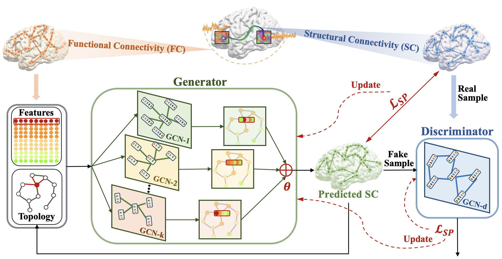

# Recovering-Brain-Structure-Network-Using-Functional-Connectivity
### Framework:

### Papers:

This repository provides a PyTorch implementation of the models adopted in the two papers:

- Zhang, Lu, Li Wang, and Dajiang Zhu. "Recovering brain structural connectivity from functional connectivity via multi-gcn based generative adversarial network." International Conference on Medical Image Computing and Computer-Assisted Intervention. Springer, Cham, 2020.
- Zhang, Lu, Li Wang, and Dajiang Zhu. "Predicting Brain Structure Network using Functional Connectivity."  in process.

The first paper proposes the Multi-GCN GAN model and structure preserving loss, and the second paper further expands the research on different datasets, different atlases, different functional connectivity generation methods, different models, new evaluation measures, and new results have been obtained.

### Code:

#### model.py
We implemented different models here, including two different CNN-based generators, GCN-based generator and GCN-based discriminator. You can choose different models in train.py file. The different topology updating methods and differnet initializations of learnable combination coefficients of multiple GCNs (theta) can be directly changed in this file, and we have annotated in this file about how to change them.

#### dataloader.py
This file is the preprocessing and normalization of the data. All the details have been introduced in the two papers except the empty list. There are two ids in the empty list for each atlas. Each id corresponds to one brain region which is an empty ROI without any voxels. Therefore the corresponding two rows and columns in the generated SC and FC are zeros. We deleted the these rows and columns.

#### train.py
You need to run this file to start. All the hyper-parameters can be defined in this file.

Run `python ./train.py -atlas='atlas1' -gpu_id=1`. 

Tested with:
- PyTorch 1.9.0
- Python 3.7.0

### Data:

We used 1064 subjects from HCP dataset and 132 subjects from ADNI dataset in our research. For each subject we generated the structural connectivity (SC) and the functional connectivity (FC) matrix. All of the connectivity matrices can be shared for research purpose. Please contact the author to obtain the data by sending email to lu.zhang2@mavs.uta.edu.

### Citation:

If you used the code or data of this project,  please cite:

    @inproceedings{zhang2020recovering,
      title={Recovering brain structural connectivity from functional connectivity via multi-gcn based generative adversarial network},
      author={Zhang, Lu and Wang, Li and Zhu, Dajiang},
      booktitle={International Conference on Medical Image Computing and Computer-Assisted Intervention},
      pages={53--61},
      year={2020},
      organization={Springer}
    }

